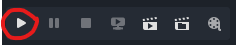

# Terror on the Tracks (Demo)

This demo aims to help people get familiar with Godot, as well as providing a minimal example of how we can structure the game. The README file will cover the implementation details of the demo and some useful information I gained when learning Godot.

## Some Useful Information

- **About the scripting language:** Godot 4 supports GDScript, C#, and C++ (through extension). I would not recommend C++ because it is barely a scripting language. C# is the scripting language for Unity (if you don't know C#, it is kind of a mixture of C++ and Java with lots of syntactic sugar). To use C# as the scripting language, you need to install the .NET version of Godot and install the .NET SDK. GDScript is a Python-like language developed by Godot. It is also the most beginner-friendly choice, and integrates well with Godot. If I remember correctly, not all of us know C#, so I recommend GDScript.

- **Choice of indentation:** Godot allows either tab indentation or space indentation but not a mixture of both. Since we are collaborating as a group we have to stick to one of them. I suggest we all use 4 spaces as the indentation. Make sure you change the settings at `Editor > Editor Settings > Text Editor > Behavior > Indent`, because when you save a script file Godot Editor will auto-format.

- **A quick overview of Godot's structure:** Godot is a lightweight game engine with minimalist design. To make a game with Godot, you create several scene files (e.g. main menu scene, game scene). Each scene is a tree structure where the nodes represent game objects (both visible and invisible). Unlike Unity or Unreal Engine, each node is allowed to bind to ONE script file only. There are also different node types, where each type has predefined features and parameters.

## How to Play the Demo

1. Clone the repository to your local machine and open it in Godot Editor.

2. Click the play icon on the upper-right corner to start the demo.

    

3. The white circle is the player. The red circle is an NPC. The pink rectangles are obstacles/walls.

4. Basic controls:
    - Player movement: `W` `A` `S` `D`
    - Move the camera (debug feature): `<` and `>` (can only switch between car 1 and the non-existent car 2)
    - Talk to NPC: `E`
    - Continue dialogue: `E`
    - Exit dialogue: `esc`

## File Structure

```
terror-on-the-tracks-demo/
├── project.godot
├── scenes/
│   └── game.tscn
├── prefabs/
│   ├── ui
│   │   ├── xxx.tscn
│   │   └── ...
│   └── node
│       ├── yyy.tscn
│       └── ...
└── scripts/
    ├── common/
    ├── controllers/
    └── systems/
```

- `terror-on-the-tracks-demo/`: The project folder. If you see `res://...` in the script, the `res://` part refers to this folder.
- `project.godot`: The project file. Contains the project settings and other important information. Don't touch it.
- `scenes/`: Contains all scenes. The demo only has one scene, which is the game scene.
- `prefabs/`: Prefabs are premade nodes that can be easily instantiated in the game session. Includes both game node prefabs and UI prefabs.
- `scripts/`: Contains all scripts.
    - `common/`: Contains utility data and functions shared by all other scripts. E.g. parameters, basic shapes, math tools, string tools, etc.
    - `controllers/`: Controllers are scripts that bind to an "actor" node (i.e. nodes capable of performing actions) in the scene. Most controller scripts are independent of each other.
    - `systems/`: Systems are singleton instances that bind to a "system" node (i.e. inactive nodes whose only purpose is to carry the system script). They are frequently referenced and used by other system or controller scripts.

## Scene Structure

To open the game scene, select `Scene > Open Scene...` and choose the file with path `res://scenes/game.tscn`.

```
scene (Scene2D)
├── xxx_system (Node)
├── yyy_system (Node)
├── ...
├── camera (Camera2D)
├── hud (Control)
│   └── ...
├── player (CharacterBody2D)
│   ├── sprite (Sprite2D)
│   └── collision (CollisionShape2D)
├── npc (CharacterBody2D)
│   ├── sprite (Sprite2D)
│   ├── collision (CollisionShape2D)
│   └── dialogue_range (Area2D)
└── classroom (Node)
    ├── obstacle1 (StaticBody2D)
    │   ├── sprite (Sprite2D)
    │   └── collision (CollisionShape2D)
    ├── obstacle2 (StaticBody2D)
    ├── obstacle3 (StaticBody2D)
    └── ...
```

- `scene`: The scene node.
- `xxx_system`: System nodes. Each of them carries a system script. The node themselves are useless.
- `camera`: Need this to render the scene. The camera also has a controller script because theoretically it needs to follow the player when entering another car (even though it doesn't in the demo).
- `hud`: The heads up display (HUD). Control type nodes are UI nodes.
- `player`: The player node (displayed as a white circle). CharacterBody2D is used because it enables collision detection and custom movement script.
    - `sprite`: Displays the player on the screen. Without this the player would be invisible.
    - `collision`: The collision box of the player. Without this the player can go through the obstacles.
- `npc`: The NPC node (displayed as a red circle). Same structre as the player node except it has an extra child node.
    - `dialogue_range`: Acts like a radar that checks if player is close enough to activate a dialogue. You can check its controller script to see its logic.
- `classroom`: A parent node of all obstacles. Has no purpose except for collapsing the long list of obstacle nodes so the scene tree looks more visually appealing.
    - `obstacle`: Every child node of `classroom` is an obstacle node. Same structure as the player node except that it is StaticBody2D type, since it is a static collidable object with no movement.

## Script Structure

As introduced in the folder structre section, there are three types of scripts: utility scripts, controller scripts, and system scripts. Utility scripts are just reusable pieces of code that are not central to the script structure. The other two are designed for very different purposes and principals:

- Controller scripts are specific to a single node or a single type of node in the scene tree. They directly control the behavior of their corresponding node. There are very little connections between different controllers (unless their nodes are very closely related).

- System scripts set up singleton systems that can be accessed anywhere in the scene. If controllers are independent vertices, systems would be the lines that connect them together.

### Controllers:
    TODO: introduce extends, _ready(), and _process(delta)

### Systems:

In general, to access a system in any script:
```gdscript
extends Node

var xxx_system  # The name of the system.


func _ready() -> void:
    # Wait until _ready() is called so all nodes are initialized
    # $/root/scene/xxx_system returns the node in the path "/root/scene/xxx_system"
    xxx_system = $/root/scene/xxx_system

    # Then you can use the variables and functions defined in xxx_system.gd
    xxx_system.some_variable += 1
    xxx_system.some_function(param1, param2)
```

There are four systems in the demo:

- **Event system (file_systems.gd):**
    The event system is in charge of dispatching events between scripts. This system is so useful that almost every controller and other system needs to use it. Here is an example of its usage:

    `script1.gd`: emits an event
    ```gdscript
    extends Node

    var event_system: EventSystem


    func _ready() -> void:
        event_system = $/root/scene/event_system

        # Can pass in any data you like, but I recommend JSON data
        event_data = { ... }
        event_system.emit("event-type", event_data)
    ```

    `script2.gd`: listens to an event
    ```gdscript
    extends Node

    var event_system: EventSystem
    var listener_id := 0  # 0 is the "null" listener id that will never be used


    func _ready() -> void:
        event_system = $/root/scene/event_system

        # This adds a listener to the event system
        # Whenever somebody emits an event with type "event-type", the on_event_emitted
        # function would be automatically called.
        event_system.add_listener("event-type", on_event_emitted)


    func _exit_tree() -> void:  # Called when node is removed
        event_system.remove_listener(listener_id)  # IMPORTANT: need this to clean up!!!


    func on_event_emitted(event_data) -> void:
        # event_data will be exactly the same as what you provided in script1.gd.
        ...
    ```

- **Dialogue system (dialogue_systems.gd):**
    The dialogue system allows players to start a dialogue with an NPC. Unlike the event system, which can connect any arbitrary two parties, the dialogue system involves the following three types of actors:

    - Player
    - NPCs
    - UI

    Generally, the dialogue system goes through the following process:

    1. NPCs checks if Player is in range for a dialogue to occur (by collision detection). They report this information to the dialogue system.
    2. Player initiates the dialogue by signalling the dialogue system. The latter searches for the closest NPC in range.
    3. Once the target NPC is found, the dialogue system ask the NPC to provide a dialogue tree, and displays relevant information on the UI.
    4. Player navigates the dialogue tree by continuing or making choices. The UI is updated each time the player continues or makes a choice.
    5. Once the dialogue ends or the player explicitly exits the dialogue, the UI is hidden again.

- **Input system (input_systems.gd):**
    The input system detects user input (i.e. keyboard, mouse, etc.) and converts it into game events. For example, user pressing the `W` key would be mapped into "player move upward" event. As introduced in the event system section, the input system emits the "player move upward" event, and the `player_controller.gd` script would listen to this event and move the player accordingly.

- **Debug system (debug_system.gd):**
    As the name suggests, this system is purely used for debugging. It defines a single debug feature, which is to move the camera between "cars". The script itself is very simple and self-explanatory: it emits a `game::switch-car` event, which is listened in the file `camera_controller.gd`.

### Utilities:
    TODO
